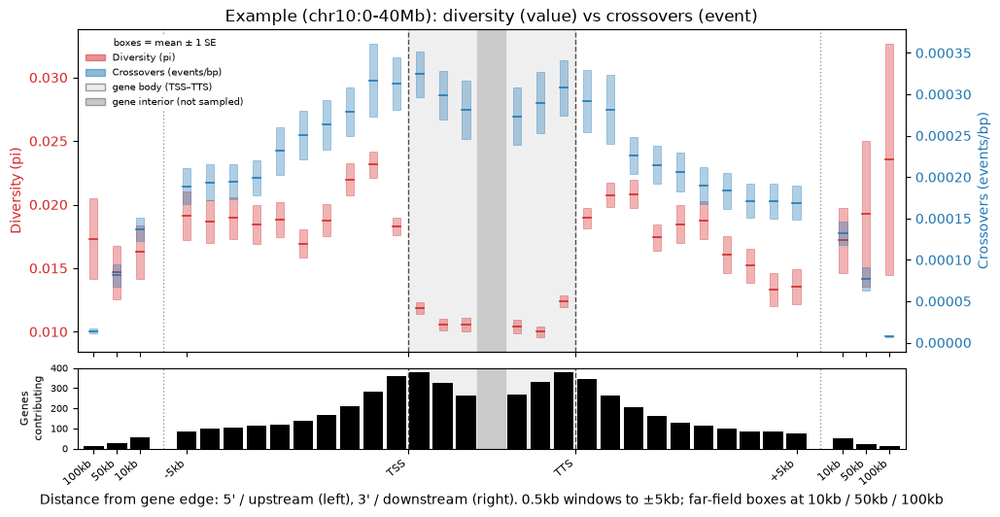
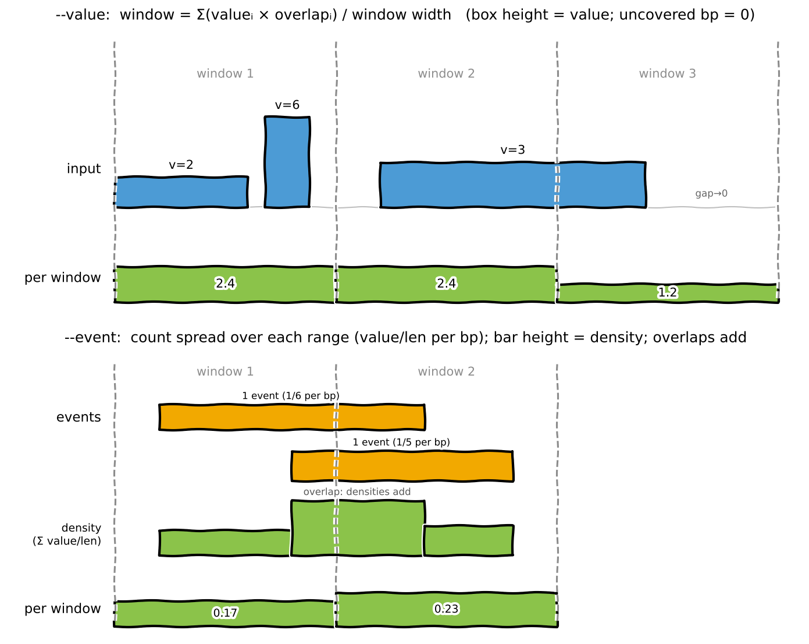

# metaboxplot

Gene metaplots with box plots and gene counts.

`flank_metaplot.py` profiles one or two genome-wide bedGraph tracks around genes:
it draws a **mean ± 1 SE box** for every position slot — linear 5′/3′ flanks, bins
inside the gene body from the TSS and TTS, and optional far-field boxes at chosen
distances (e.g. 10/50/100 kb) — with a bottom panel showing how many genes
contribute to each slot.



*Nucleotide diversity π (value, left axis) vs crossovers (event, right axis)
around maize genes on chr10:0–40 Mb.*

## Install

```bash
conda env create -f environment.yml
conda activate metaboxplot
```

Dependencies are just Python ≥3.11, numpy, pandas and matplotlib.

## Quick start

Using the bundled example data (chr10:0–40 Mb of maize B73 v5, 637 genes; runs in
seconds):

```bash
# Two value tracks: recombination rate + diversity (pi)
python flank_metaplot.py \
  --gff example_data/genes.chr10_0-40Mb.gff3 \
  --bed example_data/recomb_rate.bedGraph --value 4 \
  --bed example_data/pi.bedGraph          --value 4 \
  --label "Recombination (cM/Mb)" --label "Diversity (pi)" \
  --output recomb_vs_pi.png

# One value + one event track: diversity (pi) vs crossovers
python flank_metaplot.py \
  --gff example_data/genes.chr10_0-40Mb.gff3 \
  --bed example_data/pi.bedGraph          --value 4 \
  --bed example_data/crossovers.bedGraph  --event 4 \
  --label "Diversity (pi)" --label "Crossovers (events/bp)" \
  --plot_color "#d62728" "#1f77b4" --legend-loc "upper left" \
  --output pi_vs_crossovers.png
```

The example data is intentionally **variable-width** — recombination on the
native map intervals, π pooled into multi-window bins, crossovers flattened from
segments — so a run with `--win 500` really does integrate across mismatched
boundaries.

## Input

Input tracks are **bedGraph/BED** files: tab-separated `chrom  start  end  value…`,
0-based half-open, one or more value columns. Leading `track` / `browser` / `#`
header lines are ignored.

- `--bed FILE` gives an input file; repeat it once for a **second** file (max 2).
- `--value`/`--event` select **1-based column(s)** to plot, and each binds to the
  **most recent** `--bed`. So columns can come from one file or two:

  ```bash
  # one file, two columns
  --bed all.bedGraph --value 4 --event 5

  # two files, one column each
  --bed recomb.bedGraph --value 4 --bed crossovers.bedGraph --event 4
  ```

At most **two columns total** are plotted (any mix of value/event). With two, the
first is drawn on the left y-axis and the second on a right (twin) axis, in the
order the columns appear on the command line.

## value vs event

Every range is treated as **piecewise-constant over the bp it spans**. A window's
value is the overlap-weighted integral of the per-bp density divided by the full
window width `X`:

```
window value = Σ_i ( density_i · overlap_i ) / X
```

where `overlap_i` is the bp of range *i* inside the window. Bp not covered by any
range count as **zero**; a window with no coverage at all is skipped (not zeroed).
The two modes differ only in the per-bp density:

- **`--value`** — density = the column value. The value is a *level/rate* held at
  every bp of the range (e.g. cM/Mb, π). A 1500 bp range with value 3 contributes
  3 at each of its bp.
- **`--event`** — density = value / range_bp. The value is a *count of events*
  spread uniformly over the range, so each bp carries value/length. 3 crossovers
  in a 1500 bp range → 3/1500 per bp; integrating over a window gives the expected
  number of events per bp in that window.

For fixed-width windows the two are proportional, but event mode is the correct
choice when ranges vary in length or when the quantity is a count localised to an
interval (crossovers, mutations, peaks).

## How windows are computed



Because ranges are integrated by **overlap** rather than assigned to a single bin,
the input ranges do **not** need to match the analysis window (`--win`) size:

- **Ranges smaller than a window** (or not aligned to it) are pooled: each
  contributes `value × its overlapping bp`, so a window's value is the
  overlap-weighted mean of every range touching it.
- **Ranges spanning several windows** are split across them by overlap.
- **Gaps** (bp covered by no range) count as **zero** for `--value`; a window
  with no coverage at all is skipped rather than plotted as zero.
- **Overlapping ranges**: the input is assumed to be a proper, *non-overlapping*
  bedGraph. Overlapping intervals (e.g. crossover segments) must be flattened
  first so their per-bp densities **add** — this is how the example
  `crossovers.bedGraph` event track was built from crossover segments.

## Options

| Option | Description |
| --- | --- |
| `--gff FILE` | **(required)** GFF3 gene annotations; `gene` features define TSS/TTS edges and strand. |
| `--bed FILE` | **(required)** Input bedGraph/BED. Repeat once for a second file (max 2). |
| `--value COL [COL …]` | 1-based column(s) plotted as a VALUE track (value held at every bp). Space- or comma-separated. |
| `--event COL [COL …]` | 1-based column(s) plotted as an EVENT track (per-bp density = value / range_bp). |
| `--label TEXT` | Legend label per series, in command-line order (repeat per series). |
| `--ylabel TEXT` | Y-axis label per series (repeat per series). |
| `--plot_color COLOR [COLOR …]` | Box colour per series, in command-line order (default blue, red). |
| `--gene_color COLOR` | Colour of the bottom gene-count bars (default black). |
| `--legend-loc LOC` | Legend position: `best`, `upper right` (default), `upper left`, `lower left`, `lower right`, `right`, `center left`, `center right`, `lower center`, `upper center`, `center`, or `none` to hide it. |
| `--flank-bp N` | bp upstream and downstream of each gene profiled in the flanks (default 5000). |
| `--win N` | Window/bin size in bp for flanks and body bins (default 500). |
| `--body-bins N` | Number of `--win` bins profiled inward from each of TSS and TTS (default 3); the interior past the gene midpoint is not sampled. |
| `--box-dists [N …]` | Centre distances (bp) of the far-field boxes on each side (default 10000 50000 100000). Any number; sorted automatically; pass none to disable. |
| `--box-halfwidth N` | Half-width (bp) of each far-field box (default 250 = a 500 bp window). |
| `--output PATH` | Output figure path; extension sets the format, `.pdf`/`.png`/`.svg` (default `flank_metaplot.pdf`). |
| `--title TEXT` | Plot title. |

Run `python flank_metaplot.py --help` for the full, authoritative list.

## Notes

- Set `--win` to match (a whole multiple of) your bedGraph window size; if
  `--flank-bp` is not a multiple of `--win` the script warns and profiles to the
  nearest whole window.
- Flanks and far-field boxes are clipped at the midpoint to the neighbouring gene
  so a gene's profile never reaches into its neighbour.
- The per-gene value is averaged across genes with data in each slot; boxes show
  that mean ± 1 SE and the bottom panel shows the contributing-gene count.

## Citation

If you use this, please cite:

Ross-Ibarra J. 2026. Metaboxplot: transparent plotting of data around genes.
[](https://doi.org/10.5281/zenodo.21180779)

## Credits

This project was built with [Claude](https://www.claude.com/product/claude-code)
and [Codex](https://openai.com/codex/).
